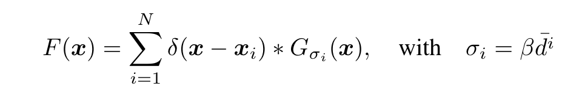
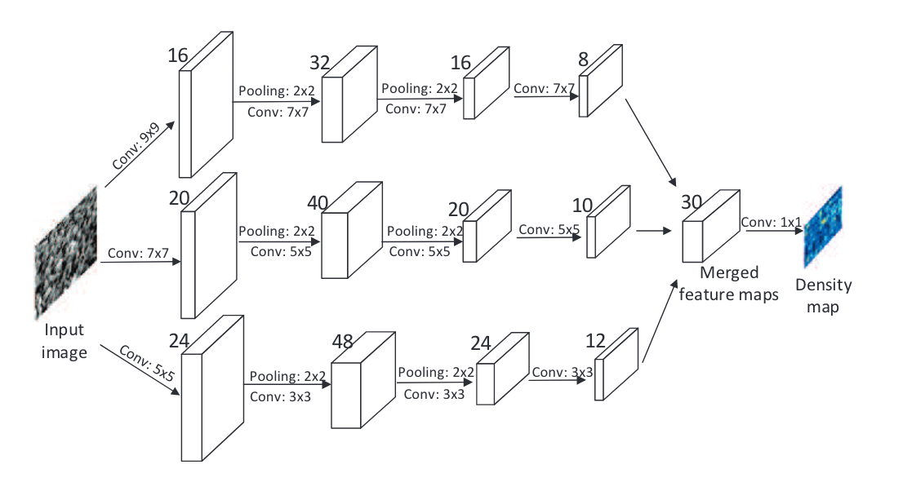
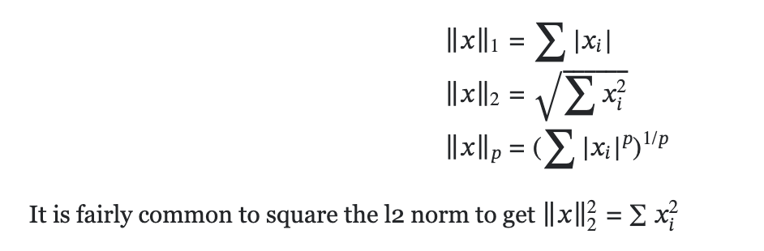
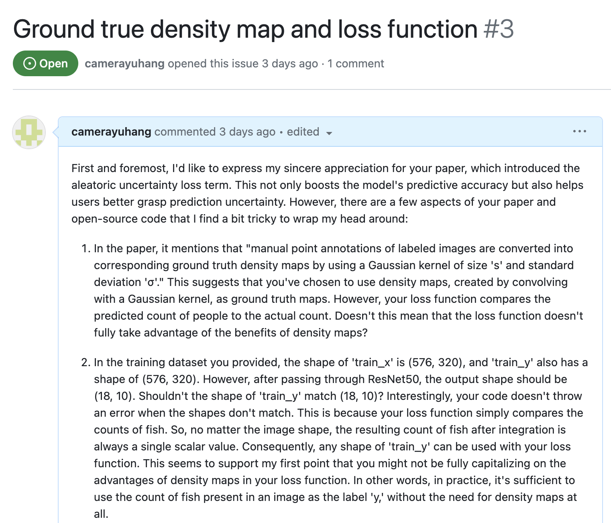

# <!-- fit -->From Crowd Counting to Fish School Counting Using Deep Learning

###### Presenter：王宇航

###### Date：2023-09-08

---

<!-- paginate: true -->

# Menu

1. Crowd Counting
2. Fish Counting
3. Learning Tools Sharing

---

<!-- header: 1. Crowd Counting  -->

# 1. Crowd Counting

人群计数，直白的讲就是一种通过计算机计算或估计图像中人数的技术。通过对人群聚集的分析，可以帮助城市管理者、大型活动组织方实时了解人群拥挤情况。例如在疫情期间，就需要通过人群计数，来判断人群的拥挤程度，防止疫情的传播。目前主要有三种方法来解决人群计数问题。


---

## 1.1. Detection based methods

这个方法中，使用检测框来框选图像中的每个人，检测框即`bounding box`，这个要求每个人的轮廓足够清楚，比较适合检测面孔，但是当图片或视频中存在密集的人群时，无法给出令人满意的结果。因为图像中人群非常密集时，每个人的特征就难以区分。


---

## 1.2. Regression based methods

因为基于目标检测的方法在人群很密集的情况下效果不好，因此衍生出了基于回归的方法。但是基于回归的方法是将图像直接映射成具体的人数，听起似乎符合逻辑，但是这种方法所得到的结果无法理解人群的分布，所以并不是最好的方法

---

## 1.3. Density estimation based methods with deep learning

基于密度估计的方法，可以将一个图像映射成一个人群的密度图，并通过密度图再计算出的一个图像的人数。这个方法不仅可以知道人群的密度分布，也知道一个图像中人的数量，再配合深度学习模型，是目前主流的预测人群数量的方法


---

## 1.4. Paper reading

我认为如果要想快速掌握这些方法的具体使用，应该搜素这领域这几年的一些重要的论文，尤其具有转折点的论文，就是说未来的论文都是基于他的方法进行修改。

在计算机视觉领域，有三大顶会：

- **CVPR** - Conference on Computer Vision and Pattern Recognition
- **ICCV** - International Conference on Computer Vision
- **ECCV** - European Conference on Computer Vision

---

<p style="font-size: 32px;">经过一系列的搜索，发现 CVPR 的 2016 年的一篇论文特别重要，后面的论文都是基于他的方法或者数据集进行训练。这篇论文创新点是通过神经网络将图像映射成密度图，并且开创了一个全新的数据集，<strong>Shanghaitech</strong>，这个数据集如今已成为业内性能指标必刷榜之一。虽然这篇论文年代已久，但是很值得学习</p>


---

<!--footer: Single-Image Crowd Counting via Multi-Column Convolutional Neural Network-CVPR 2016-->

这篇论文的背景是 2015 年上海发生了严重踩踏事件，造成了 35 人死亡，因此研究人群计数越来越重要。我认为这篇论文有以下重要之处：

1. 如何生成密度图
2. loss function 是什么样的
3. 使用什么样的评价指标

在认真阅读完这篇论文以及复现其代码后，就会很清楚计数问题该怎么解决

---

<!--header: 1.4. Paper reading-->

### 1.4.1 Density map via geometry-adaptive kernels

由于神经网络需要学习`image X`到`groud true density map Y`的映射关系，因此所提供给模型的密度图的质量非常关键，这篇论文提出了`geometry-adaptive kernels`。

---

首先将图像转换成一个密度图通过`delta function δ(x − xi)`. 这个 delta function 原来是`δ(x)`，这个函数很奇怪，因为它不是一个传统的函数，而是一个分布函数。这个函数在 x 不为 0 处的值都是 0，但是对这个函数进行积分，结果却是 1，原因是在 0 处的值为 ∞


---

这些公式直观上不好理解，放到图像中比较好理解了。就是在图像某个 pixel 上有人头，那么这个 pixel 的值就是 1，如果图像中有 N 个人头，那么就用右边这个函数表示


通过这个方法，我们可以得到一个密度图，就是这个图像只有在有人头的 pixel 值为 1，其他 pixel 全是 0，对密度图的每个 pixel 进行求和运算，就能得到这个密度图人数

```python
count = np.sum(density_img)
```

---

但是这样的密度图还是不能拿来训练的，论文中指出，需要将密度图转换为**连续的密度图**，即将密度图使用高斯核进行卷积。高斯核是一个高斯分布的核，由两个参数来控制，窗口的`size`，以及扩散参数(variance)`σ`.`σ`决定了高斯核里每个位置的权重


---

通常情况下，图像经过的高斯核卷积，这个高斯核的`σ`都是固定的。但是作者认为应该根据图像中不同人的人头大小，自适应的更改对应`σ`，从而卷积时对应的卷积核就权重就会改变。但是由于照片拍摄下来是有扭曲的，不能反映真实的 3D 场景。照片中的一个人头与周围`k`个最近的人头的距离，可以反映这样几何扭曲的情况,并且论文中也指出人头的大小与这个距离有关。因此作者提出`geometry-adaptive kernels`，



第一项表示使用`delta function H(x)`所生成的密度图，第二项使用`geometry-adaptive kernels`对密度图进行卷积。

---

训练集的`train_X`和`train_Y`如图所示:
可以看出人群计数要解决的图像，都是人非常多的图像，几百到几千的氛围


---

### 1.4.2. Multi-column CNN for density map estimation

本篇论文提出了多列的 CNN 神经网络`MCNN`，有三个分支，每个分支的`kernel size`都不一样，这样的目的是让不同分支的神经网络可以获取图像中不同尺寸的人头大小。除了`filter`的`kernel size`不一样，三列网络的其他设置都是一样的

> MCNN is motivated by MDNN（Multi-column deep neural networks for image classification）with 2 max pooling layers



---

### 1.4.3. Loss function

为了让模型预测的密度图与`ground true density map`尽可能的一致，使用了如下的`loss function`。这里对每一个样本使用了`L2 norms`。


> The `norm` acts on a vector. The different norms are defined as follows:
> 

---

### 1.4.4. Optimizer and Pretrain

可能当时没有出现 Adam optimizer，论文中使用的是`stochastic gradient descent(SGD)`。在模型训练之前，作者让每个分支都对数据先进行训练，最后将三个分支合并起来`fine-tune`所有的参数。如果训练集的数量较少，作者建议那么只会训练最后一层，前面几层都会被固定。

### 1.4.5. Evaluation metric


---

### 1.4.6. Shanghaitech dataset

这篇论文之所以重要，是因为它收集并开源了一个全新的数据集，这个数据集分为`PartA`和`PartB`。可以看出`PartA`的图像中，人数远大于`PartB`。人数越大范围的数据集，训练出来的`MAE`都会偏高，这是无法避免的。


> `PartA`, using `geometry-adaptive kernels` to generate the density maps
> `PartB`, using `same spread in Gaussian kernel` since the crowd is relatively sparse

---

### 1.4.6. Comparison of different loss functions

除了前面介绍的 loss function，还有另一种 loss function，这种 loss，不是将 `predicted density map` 与 `ground true density map` 进行对比，而是将 `predicted count` 和 `actual count` 进行对比。人数越多，预测出来的`MAE` 也越大。


> LBP+RR: regression based
> MCNN-CCR: loss for counts

---

<!-- footer: CSRNet: Dilated Convolutional Neural Networks for Understanding the Highly Congested Scenes-CVPR 2018 -->

### 1.4.7. CSRNet Paper

在 MCNN 这篇论文之后，又出现了一篇很重要的论文，来自 CVPR-2018 的一篇,这篇论文的代码在 github 上的 stars 有 600 多，算是很多人阅读过。


---

这篇论文所使用的密度图生成方法，loss function 都与 MCNN 一致，但是模型不同，最后精度也从 100 多提高到 60 多，可以说是巨大的提高。论文经过试验直接表明：

- 多列的 CNN 模型的性能还不如只有一列普通的，更深的 CNN 模型
- MCNN 的三列 CNN 中，性能表现都一致，不是原文说的那样不同列可以提取不同的特征
- MCNN 非常不好训练，因为需要事先对每一列进行预训练

---

### 1.4.8. CSRNet model

`CSR(Congested Scene Recognition)`模型它使用`vgg-16`作为`front end`，并使用`Dilated convolution`作为`back end`。`vgg-16`是一个配置非常简单的 CNN，且深度较深的模型，每一层配置全是`3x3 kernels`，这使得 CSR 模型十分简洁


---

### 1.4.9. Dilated convolution

在模型的后端，使用了`Dilated convolution`。这是一种扩散卷积，扩散的幅度`dilation rate`来决定,通过不同`dilation rate`来提取更大范围的特征，优势是

1. kernal size 一直是 3x3，使得模型参数的数量不会变化。


---

2. 可以替代 maxpooling+convolution layer，所输出的信息更详细


---

<!-- header: 1.5. Code Implementation  -->

## 1.5. Code Implementation

经过上面两篇的学习，我开始使用 Pytorch 来复现两篇论文的代码，由于 MCNN 论文是使用 Caffe 来实现的，这个是很久以前的框架，由于 Pytorch 的出现，越来越少的人会去使用 Caffe。因此只用 pytorch 简单写了一下第一篇论文的模型。

---

### 1.5.1. MCNN code


---

### 1.5.2. CSR code


---

#### 1.5.3. Trian.py in CSRNet Paper

大部分的深度学习代码的训练部分，python 代码基本都是面向过程的写法。由于我本人编程习惯，喜欢使用面向对象的方式来写 python，因此在训练，验证部分，我都写到一个 class。我这么写的目的是，我可以很好的在 jupyer notebook 中直接调用这个 class 暴露的方法，来预览我的数据集，模型，以及预测结果。

```python
class CSRTrain:
  def __init__(self, learning_rate=3e-4, decay=1e-5, batch_size=4, test_batch_size=1, epochs=400, dataset="part_A", checkpoint_name="csr_checkpoint_part_A.pth") -> None:
  # Hyperparameter
  def set_hyperparameters(self, learning_rate, decay, batch_size, epochs, test_batch_size):
  def load_dataset(self):
  # data augmentation
  def define_data_augmentation(self):
  # define loss and optimizer
  def complie(self):
  def train_loop(self, dataloader: DataLoader, model: nn.Module, loss_fn, optimizer):
  def validation_loop(self, dataloader: DataLoader, model: nn.Module, loss_fn):
  # logging configure
  def set_logging_config(self):
  def save(self, loss, mae, mse, model: nn.Module, optimizer):
  def run(self):
```

---

- 对 shanghaitech 进行训练时，发现一个问题，由于 shanghaitech 的 PartA 数据集中，每个图像的 shape 都是不一样的，如果使用 resize，势必会导致图像扭曲，这是论文作者不建议的，因为密度图的生成会使用到上面所提到的`geometry-adaptive kernels`，扭曲之后距离也会发生变化。并且由于 tran_x 和 train_y 都是图像，对 x 进行的修改，必须作用到 y，否则 x 与 y 就不匹配，如果对密度图进行 resize，resize 会使用到插值，势必会影响到密度图的人数。
- 作者所提供的代码是将 batch size 设置为 1，但是如果将 batch size 设置为 1 的话，loss 会震荡的很厉害,会变成`Stochastic gradient descent`。所以我死活训练不到论文中要求的精度，并且也有一大批人在 github 的 issue 里向作者提问说，训练的得到的 MAE 特别高，但是作者都没有正面回应，且作者也不提供预训练的模型。

---


---

1. 首先我将 `Part A` 的数据进行 `crop`，由于有的图像很小，不够裁剪，因此需要使用 `padding`。并且每个图像 `crop` 成 9 份，前 4 份为图像的四个角，后 5 份为 `random crop`


---

2. 其次，我修改了`learning rate` 和 `optimizer`，并加了`batchnorm`层，源代码的 lr 是`1e-7`,这里模型的配置为 3，即`混合dilation rate`

```python
def complie(self):
  self.__learning_rate = 3e-4
  self.model = CSRNet(config=3, freeze_frontend=False).to(self.__device)
  self.loss_fn = nn.MSELoss(reduction="sum")
  self.optimizer = torch.optim.Adam(
      params=self.model.parameters(), lr=self.__learning_rate, weight_decay=self.__decay)
```

---

3. 通过将`print`语句换成`logging`包，可以让日志保存在单独的文件里，方便我直观的了解训练过程。在生成的日志文件里，可以看到我在第`Epoch 151/400`就找到最低的 MAE。并且 MAE 比原论文提高了 3 点，注意我这里使用的配置 3 进行训练。

```powershell
2023-08-10 13:01:55,456 - INFO - Epoch 150/400
2023-08-10 13:01:55,456 - INFO - -------------------------------
2023-08-10 13:02:58,829 - INFO - Train Error - batches:  75/ 75 - samples: 300/300 - loss: 7.6168 - MAE: 54.4913 - MSE: 74.6643
2023-08-10 13:03:10,291 - INFO - Test Error - batches: 182/182 - samples: 182/182 - loss: 77.2686 - MAE: 137.0996 - MSE: 184.2028
2023-08-10 13:03:10,291 - INFO - Epoch 151/400
2023-08-10 13:03:10,291 - INFO - -------------------------------
2023-08-10 13:04:13,518 - INFO - Train Error - batches:  75/ 75 - samples: 300/300 - loss: 6.4217 - MAE: 39.3705 - MSE: 52.0474
2023-08-10 13:04:24,946 - INFO - Test Error - batches: 182/182 - samples: 182/182 - loss: 76.0832 - MAE: 68.3366 - MSE: 125.1305
2023-08-10 13:04:25,267 - INFO - saveing the checkpoint at the error of 76.0832 loss, 68.3366 mae, 125.1305 mse to csr_checkpoint_part_A_fixcrop.pth
2023-08-10 13:04:25,267 - INFO - Epoch 152/400
2023-08-10 13:04:25,267 - INFO - -------------------------------
2023-08-10 13:05:28,577 - INFO - Train Error - batches:  75/ 75 - samples: 300/300 - loss: 9.7540 - MAE: 70.0550 - MSE: 95.2593
2023-08-10 13:05:39,899 - INFO - Test Error - batches: 182/182 - samples: 182/182 - loss: 77.8660 - MAE: 114.8700 - MSE: 175.4805
```


---

# 2. Fish school counting

<!-- footer:  Deep learning with self-supervision and uncertainty regularization to count fish in underwater images-CVPR 2021 -->

鱼群计数我通过看 2021 CVPR 的一篇进行学习,这篇论文的阅读难度明显比前面两篇高很多，主要原因这篇论文对 loss function 进行了修改，并且加入了 `self supervision`。这里我对我认为有用的内容进行介绍


> Paper written by native speaker is relatively hard to read than those written by Chinese

---

## 2.1. Dataset

这篇论文是用来计算深海中鱼群的数量，论文中指出：由于在深海，能见度极低，所以用普通相机基本拍不到鱼群，所以得用声纳（Sonar）相机进行拍摄，因为它使用的是声能而不是光能。这个数据集分为 `labelled data` 和 `unlabelled data`，前者用于 `supervised learning`，后者用于 `self supervised learning`


---


---


---

## 2.3. Multi-task framework

- parameter sharing between counting and ranking tasks


---

## 2.4. Regularizing the loss term: aleatoric uncertainty

`counting task` 使用的 loss 与 `ranking task` 是不一样的。在 `counting task` 中，作者引入了 `Aleatoric uncertainty`，这个随机不确定性由图片的噪音产生的，比如海豚，网等。为了量化这个不确定性，模型在输出`density map`的同时，也要学习如何预测`noise variance map`，使得用户可以知道这个图像所预测的数量可信程度是在怎么样一个范围

  add log σ^2 as `predicted noise` to penalise the loss and multiply Lc component by `e−predicted noise`.

---

## 2.5. Regularizing: self-supervised ranking task with unlabelled data in a multi-task network

`ranking task`使用了`self-supervised learning`,就是这些的数据集都没有打上标签，输入的数据是两个图像为一对，第一个图像是大的图像，第二个图像是将第一个进行裁剪获得的小图像，所以第二个图像的人数一定比第一个图像的少。`ranking task`的 loss 就是基于这个所创造的。我认为这个`ranking task`特别有用，因为如果没有这个，模型经常会对一个`cropped image`预测出比原图更大的数量。

 pk is average value over all pixels corresponding to its density map.Loss value will be 0 if predicting the correct order.

---

## 2.6. Complete loss

整个`muti task model`的`loss function`就是把上面两个`loss term`加起来


> I think there is something wrong with this paper and its open-source code. I have already raised some issues on the author's GitHub, and I have also submitted PRs for the issues I found in their code. We will talk later.

---

## 2.7. Conclusion

密度图不仅可以得到鱼群的数量，而且还能从中观察到鱼群的分布情况，但真的是这样吗？

- 鱼群在水中可以在三个方向运动的，因此鱼群的聚集和分散也将是在三个方向上。而照片是二维的，它只能反映两个维度，就是说它不能正确的反应鱼群深度信息。当同样数量和分布的鱼，距离比相机远所生成密度图就会比距离近所生成的密度图要密集得多。
- 因此当鱼群上游到水的表面，或者养殖的水比较浅时，这时候的密度图才能最有效反应鱼群的分布情况。
- 还有一篇论文，对网箱离的鱼使用普通相机进行拍摄计数，精度不错，模型是将前两篇论文的模型拼起来。如果加上第三篇论文的 self supervised learning，也许精度会更高。

---

<!-- header: 3. Learning tools sharing  -->

# 3. Learning tools sharing

---

## 3.1. SSH

SSH（Secure Shell）是一种网络通信协议，它使两台计算机能够进行通信（与 http 不同，后者是用于传输超文本，如 web pages）。SSH 的一个内在特性是，两台计算机之间的通信是加密的，这意味着它适用于不安全的网络环境。

ssh 有主意这几个特性:

- Connecting to a remote host.
- Backing up, copying, and mirroring files using SFTP.
- Mapping a client's port to the server's port to secure TCP/IP and other network protocols.

---

ssh 来连接远程服务器与我们所理解的远程控制电脑不一样。远程控制使用的是远程桌面协议（Remote Desktop Protocol，RDP），它是用于远程控制 Windows 计算机的协议，允许用户在远程计算机上查看和操作桌面界面。

一个电脑被远程控制后，其他人是无法继续控制这台电脑的，但是使用 ssh 协议来连接远程电脑，是可以允许多个人控制同一台电脑。

在终端中输入如下命令，就可以范围远程服务器。换句话理解就是你控制的远程服务器的终端

```powershell
ssh wu@172.18.137.178
```

---

因为任何编程语言的运行，本质都是通过终端的一个命令来执行，例如 python 代码的运行就是：

```powershell
python your_file.py
```

也就是说你控制服务器的终端，就意味着基本可以控制服务器上所有资源，例如服务器上的 python 解释器。这样就使得你可以自己的电脑写代码，但是使用的是服务器上的资源运行代码，就好像在自己电脑运行上一样。

> VSCode，Pycharm 等现在代码编辑器都支持了以 SSH 的方式连接服务器

---

## 3.2 Conda

现在大多数人使用 python 编程时，基本都会使用 Conda 来对 python 进行管理。conda 可以很方便的升级 python 包，切换 python 环境。

conda 的 Distribution 目前有如下几个

1. **Anaconda**: 是一个公司的产品，由公司来主导。商用付费，个人暂时免费，最臃肿的 conda 发行版本，因为安装 anaconda 后会安装很多额外的包，并且还包括一个没什么用图形化界面，不推荐使用。
2. **Miniconda**: miniconda 和 anaconda 是来自于同一个公司的，也是由公司来主导的。它使用`anaconda.org`作为默认 channel。它是 Anaconda 轻量版，没有图像画界面，所占空间很小。
3. **Miniforge**: 由社区主导，由 GitHub 托管，完全免费。与 miniconda 一样，是 anaconda 轻量版，默认 channel 为`conda-forge`，目前主流的安装 conda 的渠道就是`conda-forge`所占空间很小，不包括可视化界面，推荐使用。

---

### 3.2.1 Mamba

除了以上三种发行版本，python 还有一种包管理工具在 Mamba，这个 Mamba 和 conda 基本差不多。Mamba 也有几个 Distribution:

1. **Mambaforge**: conda 的一种替代品，由 C++实现的，并且提供并行计算技术，使得安装 python 包时非常快,默认 channel 为`conda-forge`。使用 Mamba 的话，安装指令是`mamba install`而不是`conda install`
2. **Micromamba**: Micromamba 是 Mambaforge 非常小的版本，他拥有 Mambaforge 所有的特性，但是最重要的是，它剔除了 base 环境，因为 base 环境基本所有人都不会去使用，所以没必要保留

---

## 3.3 Git

git 是用来管理项目的工具，是一个开源的分布式版本控制系统。使用 git 来管理你的代码项目，你可以将项目切换到任意时间点，而不用担心因为代码保存而覆盖掉之的版本


---

git 最有用的方式还是配合 Github 一起使用，当在 Github 上发现有用的代码时，应该使用 git，通过 ssh 协议将代码拉下来，而不是使用下载的方式下载下来,这样拉下来的项目才能被 git 管理，而且不用解压，而下载下来的文件需要解压。

```shell
git clone git@github.com:ptarling/DeepLearningFishCounting.git
```


---

## 3.4. Github

Github 是全球最大的代码托管平台，全世界有很多为爱发电的人，把自己做的东西上传到 github 上，供所有人使用，例如上文提到的`Miniforge`等。只有被 git 管理的项目才能上传在 Github 上。Github 可以算类似一个免费的云，可以在上面存放任何代码，并且没有限制，所以越来越多的开发者以及论文作者，会把代码放在 Github 上。放在 Github 上的代码可以被任何人浏览，如果有人喜欢你的项目，就会阅读你的代码，还可能给你的代码提出修改意见。可以通过`pull requests`的方式，给别人的开源代码提出修改，如果作者同意你的修改的话，你就会成为他代码的贡献者。

---

例如我在阅读 fish counting 那篇论文，我发现它的论文以及代码有问题，所以我在作者的 Github 上提出了 issue，作者回复说很感谢我的提问，并且联系论文的通讯作者来解答我的问题。




---

这篇 fish counting 所开放的代码也有很多我无法理解的点和 bug，并且代码缺失了部分文件，例如如何将视频转换为图片帧，我修改了部分代码，并且补充了一些代码文件。我提交了我的 pull requests，如果作者同意我的 PR，那么我代码也会合并他的代码里，成为代码的贡献者之一。

---


