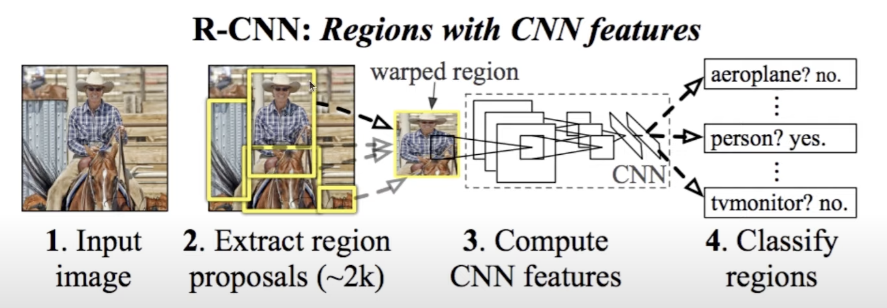
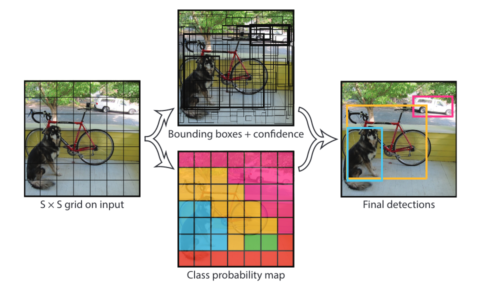

# <!-- fit -->Object Detection From Scratch

###### Presenter：王宇航

###### Date：2023-10-30

---

<!-- paginate: true -->

# Menu

1. Object Detection
2. Regions With CNN
3. YOLOv1
4. YOLOv3
5. Football Player Detection Using YOLOv8

---

<!-- header: 1. Object Detection  -->

# 1. Object detection

1. Classification is finding **what** object is in an image.
2. Object Localization is finding **what** and **where** a (**single**) object exists in an image.
3. Object Detection is finding **what** and **where** (**multiple**) objects are in an image.

---

## 1.1. Bounding box

为了定位图片中的目标，需要在目标绘制bounding box，bounding box是一个长方形，因此需要只是4个点定义，目前有两种定义方式。

Two Common ways to define BBOXES:
1. (x1, y1) is upper left corner point, (x2,y2) is bottom right corner point.
2. Two points define a center point, and two points to define height and width.

---

## 1.2. Sliding windows

最早进行目标检测的方法就是使用滑动窗口（Sliding Windows），将bounding box从图像左上角按照某个stride大小滑到右下角，每滑一次裁剪出来的图像都输入用于classification的神经网络，这样就可以即知道目标的位置，也知道是什么目标

---

## 1.3. Convolution implement of sliding Window

按照上面的那种方法，计算量非常巨大，因为你需要将原图像裁剪成一个个小图像,如果为了不会错过更小的目标，还得需要不同尺寸的bounding box来滑，这样裁剪出来的图像会更多。为了减少计算量，所以要将滑动窗口使用卷机来进行实现。
> a lot of computation

---

* 这个方法需要将原来用于classification的神经网络中的full connected layer全部换成conv layer，这样可以使输入图像为任意大小。

* 同样结构的神经网络，如果输入图像的size大于原来的图像，那么模型的输出的size也会更大。

* 输出结果的每一个cell就代表了滑动窗口的每一个窗口，这相当于一次性完成所以滑动窗口的操作。

---

--- 

即使使用滑动窗口，计算量仍然很大，而且仅一张图像，就需要很多bounding box，bounding box其实并没有目标，这样很多的运算其实都是没有必要的。

---

<!-- header: 2. Regions with R-CNN  -->

## 2. Regional based networks

后来，学者提出的R-CNN（Regions with CNN）,使用region proposal来代替滑动窗口，这样会使一个图像的bounding box大幅度减少，这属于two stage method，因为region的提出，和分类，是分开成两步来运行的。在R-CNN中使用selective search算法来提出region，可以看到，一个图像在分类前，会先提出2k～个region。这要比滑动窗口的方法要少特别多，且不需要关系bounding box的大小，算法会自己决定。

> R-CNN first appeared in a paper at CVPR in 2014

<!--footer: Rich feature hierarchies for accurate object detection and semantic segmentation-CVPR 2014-->

---

## 2.1 Fast and Faster R-CNN

在R-CNN中，使用的是selective search来提出region，但是速度仍然很慢，因此后来又提出了更快的两个模型Fast R-CNN and Faster R-CNN，这两个模型的关注于如何提高region提出的速度，他们使用neutral network来替代selective search，来提出region，这样提出的region的速度更快,但是仍然无法满足real-time要求

> Still slow, and complicated 2 step process

---

## 3. YOLOv1

YOLO的全称是You only look once，顾名思义，这个是one stage method，一种end to end的神经网络。YOLOv1提出是在CVPR-2016年的一篇论文

> YOLO要比之前基于密度图的计数要难很多，论文不好理解，代码更不好理解

---

YOLO将region的提出和region的分类合并在一起，形成统一的架构

