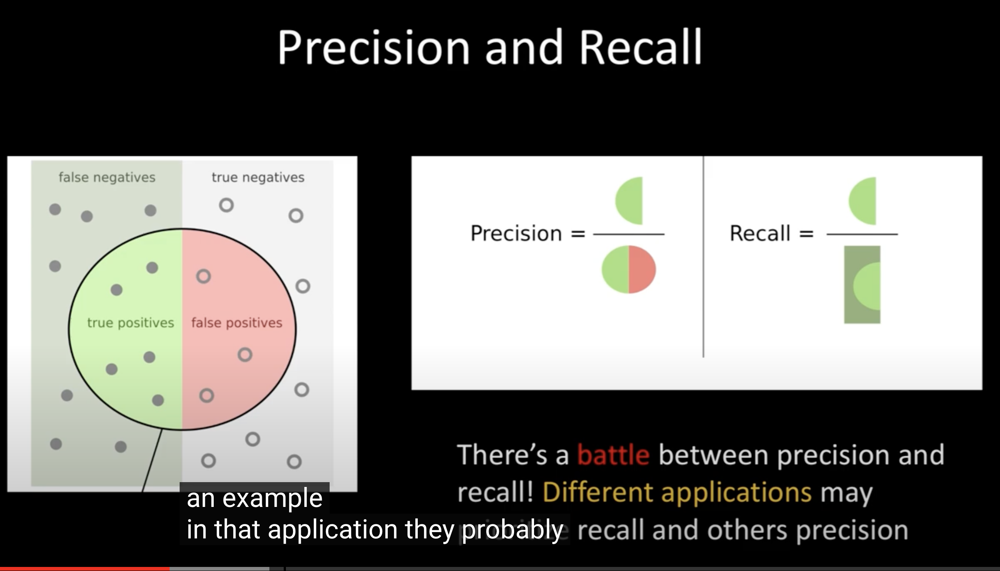
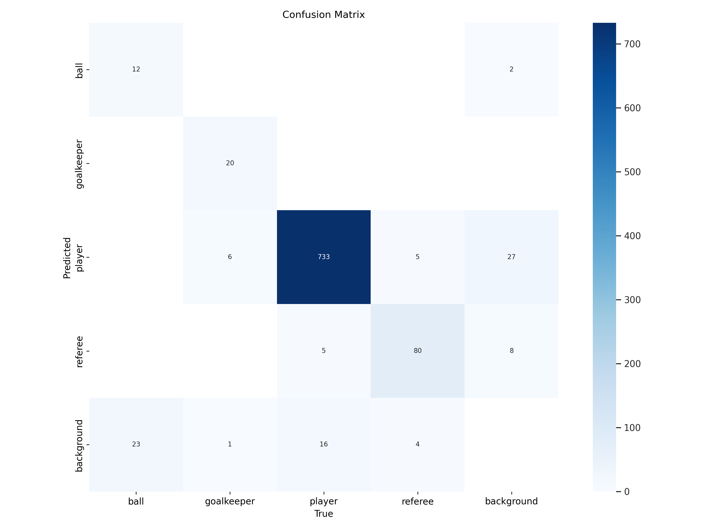

# <!-- fit -->Object Detection From Scratch

###### Presenter：王宇航

###### Date：2023-11-01

---

<!-- paginate: true -->

# Menu

1. Object Detection
2. Regions With CNN
3. YOLOv1
4. YOLOv2
5. YOLOv3
6. Football Player Detection Using YOLOv8

---

<!-- header: 1. Object Detection  -->

# 1. Object detection

1. Classification is finding **what** object is in an image.
2. Object Localization is finding **what** and **where** a (**single**) object exists in an image.
3. Object Detection is finding **what** and **where** (**multiple**) objects are in an image.


---

## 1.1. Bounding box

为了定位图片中的目标，需要在目标绘制bounding box，bounding box是一个长方形，因此需要只是4个点定义，目前有两种定义方式。

Two Common ways to define BBOXES:
1. (x1, y1) is upper left corner point, (x2,y2) is bottom right corner point.
2. Two points define a center point, and two points to define height and width.

---

## 1.2. Sliding windows

最早进行目标检测的方法就是使用滑动窗口（Sliding Windows），将bounding box从图像左上角按照某个stride大小滑到右下角，每滑一次裁剪出来的图像都输入用于classification的神经网络，这样就可以即知道目标的位置，也知道是什么目标


---

## 1.3. Convolution implement of sliding Window

按照上面的那种方法，计算量非常巨大，因为你需要将原图像裁剪成一个个小图像,如果为了不会错过更小的目标，还得需要不同尺寸的bounding box来滑，这样裁剪出来的图像会更多。为了减少计算量，所以要将滑动窗口使用卷积来进行实现。
> a lot of computation

---

* 这个方法需要将原来用于classification的神经网络中的full connected layer全部换成conv layer，这样可以使输入图像为任意大小。

* 同样结构的神经网络，如果输入图像的size大于原来的图像，那么模型的输出的size也会更大。

* 输出结果的每一个cell就代表了滑动窗口的每一个窗口，这相当于一次性完成所以滑动窗口的操作。

---


--- 

即使使用卷积实现的滑动窗口，计算量仍然很大，而且仅一张图像，就需要很多bounding box，bounding box其实并没有目标，这样很多的运算其实都是没有必要的。

---

<!-- header: 2. Regions with R-CNN  -->

# 2. Regional based networks

后来，学者提出的R-CNN（Regions with CNN）,使用region proposal来代替滑动窗口，这样会使一个图像的bounding box大幅度减少，这属于two stage method，因为region的提出，和分类，是分开成两步来运行的。在R-CNN中使用**selective search**算法来提出region，可以看到，一个图像在分类前，会先提出2k～个region。这要比滑动窗口的方法要少特别多，且不需要关心bounding box的大小，算法会自己决定。


> R-CNN first appeared in a paper at CVPR in 2014

<!--footer: Rich feature hierarchies for accurate object detection and semantic segmentation-CVPR 2014-->

---

## 2.1 Fast and Faster R-CNN

在R-CNN中，使用的是selective search来提出region，但是速度仍然很慢，因此后来又提出了更快的两个模型Fast R-CNN and Faster R-CNN，这两个模型的关注于如何提高region提出的速度，他们使用neutral network来替代selective search，来提出region，这样提出的region的速度更快,但是仍然无法满足real-time要求

> Still slow, and complicated 2 step process


---

<!-- header: 3. You only look once version 1  -->

# 3. YOLOv1

YOLO的全称是You only look once，顾名思义，这个是one stage method，一种end to end的神经网络。YOLOv1提出是在CVPR-2016年的一篇论文.


> The YOLO algorithm is much more challenging to understand compared to density-based counting methods.
 
<!--footer: You Only Look Once: Unified, Real-Time Object Detection-CVPR 2016-->

---

论文中指出原来的R-CNN模型的复杂性：

1. 需要提前提出潜在的bounding box
2. 将所提出的bounding box输入classifier进行分类
3. 分类完后，需要进行post-processing，例如refine bounding box，eliminate duplicate box， rescore the box based on other objects

这些复杂的piplines很慢，且不好优化，因为每一个的pipeline都要单独训练。


---

YOLO is a unified architecture with output shape of [S,S,B*5+C] tensor, c = 20 becasue PASCAL VOC has 20 labelled classes. Each cell predicts 2 bounding boxs


---

## 3.1. The architecture


---

## 3.2. Training

1. 该结构一共有24个conv layer + 2个FC layer
2. 前20个conv layer先在ImageNet上进行pretrain，ImageNet是一个用于classification的数据集，输入是224*224
3. 最后添加4个conv layer + 2个FC layer，输入图像由224提高为448，在PASCAL VOC数据集上进行训练

---

## 3.3. Loss function

This loss consists of 4 components: `box coordinates loss`, `object loss`, `no object loss`, and `class loss`. 
可以看到这里所有类型的loss，作者都使用`sum-squared error`。对于一个图像，模型会预测出98个bounding box


> sum-squared error for everything!


---

这里涉及到两个常数λcoord和λnoobj。论文中指出，一个图像中确实含有object的cell数量是要远远少于不含有object的cell数量。
This pushed the “confidence” scores of those cells not containing object, often overpowering the gradient from cells that do contain objects. 意思是不含目标的cell所产生的loss更多。
为了修复这一点，作者提高了coordinate loss，降低了没目标cell的loss，将λcoord设置为5，λnoobj设置为0.5


---

### 3.3.1. Box coordinates loss

Sum-squared error equally weights errors in large boxes and small boxes, but small deviations in large boxes should matter less than in small boxes.

To partially address this, author predict the **square root of the bounding box width and height instead of the width and height directly**.

> 大盒子预测出的偏差的重要性要小于小盒子，所以给w和h加上根号，这样大盒子偏差就会被缩小


---

### 3.3.2. Object loss

每一个cell还会预测一个confidence score，这个其实表示的是cell含有这个类型的目标的概率，对应的loss的第三行，Ci=1

### 3.3.3. No object loss

不含目标的cell有很多，所以需要乘上λnoobj，Ci=0


---

### 3.3.3. Class loss

这里的class其实是一个含有20个元素的vector，作者仍然使用的是sum-squared error，但是在后续的Yolo中这边换成了CrossEntropyLoss


---

## 3.4. Comparison

YOLO的设计，即将图像分成7*7的cell，强制给bounding box施加空间限制，不仅抑制了同一个目标被多次检测的可能性，而且最后预测出98个bounding box，这远远小于R-CNN一开始提出的2000多个bounding box，这使得YOLO可以满足real-time要求。但是如果抛去速度不谈，仍然是R-CNN这样的two stage模型的精度更高。


---

# 4. YOLOv2

<!-- header: 4. You only look once version 2  -->

YOLOv2又叫YOLO9000，因为他可以区分9000个目标类型。这里主要介绍一下YOLOv2主要改进的地方

<!-- footer: YOLO9000: Better, Faster, Stronger-CVPR 2016  -->

---

## 4.1. Improvement

1. High Resolution Classifier: YOLOv2在ImageNet预训练时，将输入从224直接改为448，这样与检测时的输入图像大小一致
2. Convolutional With Anchor Boxes: 效仿Faster R-CNN，预测bounding box的offset，而不是完整的bounding box。

---

## 4.2. Anchor Box

Yolov2引入了anchor box，anchor box与bounding box不同，anchor box是预定义。有了anchor box，一个cell就可以预测多个目标（Yolov1中，一个cell只能预测一个目标）。由于anchor box是预定义的，作者在训练集上运行k-means聚类方法，得到了最适合的预定义anchor box，这可以使模型更好的训练


---

配合anchor box，模型就不需要预测一个完整的bounding box，模型的预测结果，可以进行一些调整后，再转换为最终的bounding box，论文出给出了模型的预测结果与anchor box是如何配合的。Cx与Cy是相对图片左上角的偏移量，t变量是模型的输出，通过logistic activation事模型的预测限制在[0,1]范围内。P变量属于anchor box的宽和高。论文指出这样处理可以限制预测的数值，使模型训练的更稳定（因为在YOLOv1中，loss是经常震荡的）


---

# 5. YOLOv3

<!-- header: 4. You only look once version 3  -->

Yolov3沿用了Yolov2提出的anchor box，但是Yolov3最大的改进是引入了scale prediction

<!-- footer: YOLOv3: An Incremental Improvement-CVPR 2018  -->

---

## 5.1. Scale prediction

with COCO dataset, Yolov3 predicts 3 boxs at different scales and each scale predicts 3 bounding box, so the tensor is N×N×[3*(4+1+80)]


---

scale越往后，被分割的格子越多，越容易识别到更小的目标，且越后，所预定义的anchor box也越小，目的就是让越后面的scale prediction匹配更小的目标


---

# 6. Football Player Detection Using YOLOv8

目前YOLO模型已经非常成熟，不管精度和速度都已经很高了，最新的模型为YOLOv8。说了那么多，不如实际看一下YOLO的效果如何。这里我在网上收集到了足球比赛的数据集，并使用YOLOv8进行训练和预测。


---

## 6.1. Mean average precision

precision就是你所输出prediction bounding box中，确实有目标（与target相比IOU大于0.5）的占所有prediction box的比例
recall就是图像中确实有目标，你预测对了几个



---

遍历整个数据集的所有目标，例如数据集有3个image，4个object，那么可以先画出PR表


---


---


---


---

## 6.2. Train results


---

### 6.2.1. Confusion matrix

根据precision和recall可以制作混淆矩阵




---

### 6.2.1. Real-time prediction

因为Yolo算法以快著称，所以我们用它预测视频，可以看到预测时，视频每一帧的处理时间只有5.9ms，相对于1s可以处理166张图片，就是FPS166，而视频基本上是30fps左右，所以是完全可以胜任的。

```powershell
Ultralytics YOLOv8.0.203 🚀 Python-3.11.6 torch-2.1.0 CUDA:0 (NVIDIA GeForce RTX 3060, 12036MiB)
Model summary (fused): 168 layers, 11127132 parameters, 0 gradients, 28.4 GFLOPs

video 1/1 (2/345) football competition clip.mp4: 480x800 11 players, 1 referee, 5.9ms
video 1/1 (3/345) football competition clip.mp4: 480x800 9 players, 2 referees, 5.9ms
video 1/1 (4/345) football competition clip.mp4: 480x800 10 players, 2 referees, 5.9ms
video 1/1 (5/345) football competition clip.mp4: 480x800 13 players, 2 referees, 5.9ms
video 1/1 (6/345) football competition clip.mp4: 480x800 14 players, 2 referees, 5.9ms
...
```