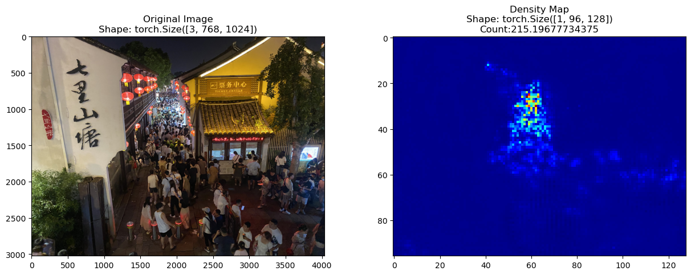

# <!-- fit -->Fish Counting in Sonar Images

###### Presenter：王宇航

###### Date：2024-03-20

---

<!-- paginate: true -->

# Menu

1. Introduction
2. The Proposed Method

---

<!-- header: Introduction  -->

水下的鱼群环境通常很复杂，且光线黑暗，还包括很多噪音。使用普通相机无法采集到鱼群的照片。成像声纳是一种氢声设备，通过发送和接收声波来检测物体，并通过将声音回声转换为数字信号，从而提供图像，从而提供了一种快速有效的方法来在长距离内监测低可见度的鱼类中的鱼类

---

早期在声呐图像中计算鱼的数量通常依赖于有经验的计数人员，但是该方法劳动力成本很高。自动的目标计数已经在人群计数中取得了很好的进展，因此可以推广到鱼群计数。

---

在声呐图像中计算鱼的数量所遇到的困难与人群计数相似，比如遮挡，背景噪音等。但是在声呐图像中计数有特别的挑战。

---

1. 最主要的挑战就是声呐图像很难区分鱼体和背景噪音，比如鱼的细节，如尾巴和鳍。因为声呐图像是通过发射声能后成像的，但是鱼类的细节（例如尾巴和鳍）太微小，它的对声的反射会丢失。这使鱼在声呐图像中像斑点，看不出鱼本身的外观和形状，和背景噪声一样都是斑点

---

---

2. 第二个挑战，声呐鱼群数据集中，鱼在输入图像中，一只鱼是没有外观的条状，而 ground true 中，鱼是呈点状。这个使 input 和 ground true 差别很大，十分影响计数精度。人群计数中，ground true 点图会使用高斯核卷积成连续的密度图，而这个高斯核的大小会根据每个人的人头的大小调整，而声呐图像中，鱼为长条状，很难用这个大小调整高斯核的大小。

---

1. 针对第一个问题，可以从全局特征的角度出发，让模型可以观察整个图像，让模型学习到哪些属于噪声，哪些属于鱼体，从而增强鱼体特征，压制背景噪声。

2. 针对第二个问题，即 input 和 ground true 不一致的问题。抛弃使用密度图的方法，而是直接使用鱼的中心点坐标。即直接预测鱼的坐标，而不是预测一张密度图。这个在人群计数中已经得到了验证

> 第二个问题的解决方法我没有使用，因为我以为密度图已经足够了。

---

<!-- header: The Proposed Method  -->

# The Proposed Method

简单介绍一下模型的各个模块

---

---

## Pyramid feature aggregation(PFA)

基于 Resnet 开发了一个金字塔特征聚合模块，该模块作为模型的特征提取器，通过不同纬度的密度图进行加权聚合，从而同时保留高维特征图的详细信息，也保留低维特征图的空间信息。最终选择$\frac{1}{8}$作为最后特征图大小，因为先前已有工作证明。

$$
AF=\alpha{HF_4}+\beta{HF_3}+\gamma{LF}
$$

加权聚合可以让模型自己学习到哪些特征图很重要，而不需要人为指定参数。配合 ranking task，进一步增强 PFA 模块的特征提取能力

---

## Global-local transformer block(GLTB)

GLTB 由两个字模块组成，一个是 Multi-scale dilated convolution (MDC)，用于提取声呐图像的局部特征，另一个是 windows-based multi-head self-attention (WMSA)，用于提取图像中的全局特征。通过这两个模块，使模型同时学习到全局与局部特征，从而增强深层特征图的鱼群特征，抑制背景噪声。

---

---

### Multi-scale dilated convolution (MDC)

在提取声呐图像的局部特征方面，使用了扩散卷积，扩散卷积可以在不增加参数的情况下，增加卷积的感受野。同时按宽度而不是按深度对扩散卷积进行排列，可以避免网格效应。同时按宽度排列，计数时间也小于按深度排列。拼接 4 种卷积核后，传入深度卷积，进一步 refine 特征图。通过该模块，帮助模型适应在局部范围内鱼群尺度与密度不一致的问题

---

### Windows-based multi-head self-attention (WMSA)

为了提取声呐图像中的全局特征，使用基于窗口自注意力机制。这里使用的图像中的注意力机制，与文本序列中的注意力机制不太一样。

---

#### computed within non-overlapping local windows

首先将 input image，$I$，denoted as $H \times W \times C$，where H, W , and 3 are respectively its height, width, and channel size.，输入一个$1 \times 1$的卷积，将 channel 扩大 3 倍，得到$H \times W \times 3C$，然后我们使用 windows partition 将图像分割为$\frac{H}{w} \times \frac{W}{w}$个窗口，每个窗口为$w \times w \times 3C$大小，得到 1D sequence $x\in \mathbb{R}^{N \times D}$，$N=\frac{HW}{K^2}$，$D=w\times w \times 3C$，并将该 sequence reshape 为用于 Q，K，V 的计算的 sequence $x\in \mathbb{R}^{N \times D}$，$N=3 \times \frac{HW}{K^2} \times h$，$D=w\times w \times \frac{C}{h}$。the window size $w$ and the number of head are both set to 8。

注意力机制其实是用在局部窗口内

> 这个是论文的草稿，所以会中英文混用

---

#### Interaction between windows

在 Swin transformer 中，不同的 window 使用 shift window 进行交互，即连续两个 transformer block，窗口之间会平移重叠。

---

而我开发了一个叫 cross-shaped window convolution operation，十字卷积操作。就是使用两个卷积核，一个卷积核是横向卷积，另一个卷积核是纵向卷积。两个卷积分别得到的特征图进行相加，从而实现对不同 window 进行交互。

---

论文中我用下面的公式表示如何建立关系。例如，对窗口 1 里的任意一个点$P_1(m,n)$，它与窗口 2 的点$P_2(m,n+w-1)$的关系可以通过如下公式进行构建

$$
  P_1^{(m,n)}=\sum_{i=0}^{w-n-1}P_1^{(m,n+i)}G^{(1,i)}+\sum_{j=0}^{n-1}P_2^{(m,n+w-1-j)}G^{(1,w-1-j)}
$$

$$
  P_1^{(m,n+i)}=S_i\left(P_1^{(m,n)} \right)
$$

$$
  P_2^{(m,n+w-1-j)}=S_j\left(P_2^{(m,n+w-1)}\right)
$$

$$
  P_1^{(m,n)}=\sum_{i=0}^{w-n-1}S_i\left(P_1^{(m,n)} \right)G^{(1,i)}+\sum_{j=0}^{n-1}S_j\left(P_2^{(m,n+w-1)}\right)G^{(1,w-1-j)}
$$

$w$表示 windows size，$G$表示核为$(1,w)$的水平卷积。

---

竖直交互同理。最终，$P_1(m,n)$与点$P_2(m,n+w-1)$的关系被构建，基于这种水平像素对的关系，窗口 1 与窗口 2 之间的水平关系被成功构建，表示为$W_1=H(W_2)$。同理，window 1 与 window 2 的竖直关系也可以被构建，i.e. $W_1=V(W_3)$。根据 window3 与 window4 的水平关系与 window2 与 window4 的竖直关系，window 4 与 window1 的关系最终可以构建为$W_1=V(H(W_4))+H(V(W_4))$。基于此，通过增加更多的中间窗口，特征图中的任意两个窗口的关系都成功的构建。因此 cross-shaped window convolution operation 能够构建窗口之间的关系，从而捕捉到图像的全局特征。

---

## Self-supervised ranking task

声呐会收集到大量的水下照片，标注任务费时费力，因此包含大量的非标注数据集，因此如何利用好非标注数据集是个问题。我们通过给模型添加辅助头的方式，仅将排序任务作用于模型的 backbone，即 FPA 上，即任何 sub-image of fish scene image 只可能包含相等或更少的鱼的数量。只作用在 backbone 上，是避免多任务模型耗费大量训练时间的问题。

$$
\hat{c}(I_k)=\frac{1}{HW}\sum^H_{i=0}\sum^W_{j=0}\hat{D}_k(i,j)
$$

$$
L_R\left(\hat{c}(I^\prime),\hat{c}(I)\right)=\max\left(0,\hat{c}(I)-\hat{c}(I^\prime)+\varepsilon\right)
$$

---

## Loss design

我们为我们的 pipeline 专门设计了损失函数。我们模型的损失函数$L$由计数损失$L_C$，total variance(TV) loss$L_{TV}$，及 pairwise ranking hinge loss $L_R$构成，

$$
L_C(z,\hat{z})=\left|{ \|  z \| _1}-{ \|  \hat{z} \|_1}\right|
$$

$$
L_{TV}(z,\hat{z})=\left\|\frac{G_\sigma(z)}{ \|  z \| _1}-\frac{\hat{z}}{ \|  \hat{z} \|_1}\right\|_2
$$

$$
L=L_C(z,\hat{z})+\lambda_1\|  z \| _1L_{TV}(z,\hat{z})+\lambda_2L_r\left(\hat{c}(I^\prime),\hat{c}(I)\right)
$$

---

# Experiment

很可惜，前两天刚发现有一篇论文的精度已经超过我了。

---

# Disadvantage

## 利用全局-局部注意力机制仍然不能很好的处理背景噪声

该篇论文，先从数据集提取的 fish mask，让模型先从 fish mask 进行学习，然后再计数，通过这种方法来提高计数精度，

---

## 仍然使用预测密度图的方法

正如第二点挑战所说，密度图不太适合声呐图像，应该使用点监督的方法，这篇论文就使用点监督的方法来预测
